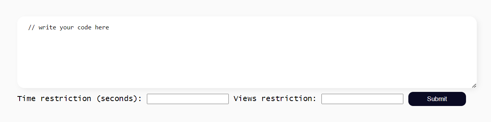
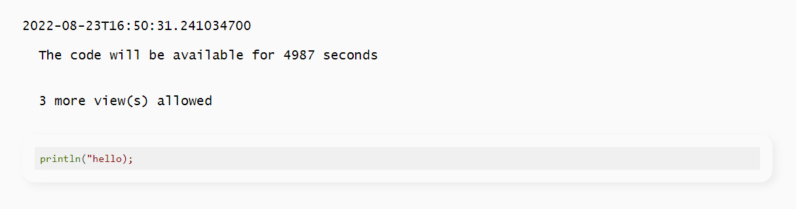
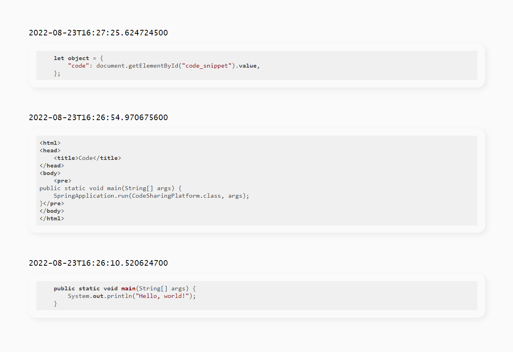

A web service that allows teams of programmers to share code.

There are two types of interfaces in this project: API and web interface.
The API interface are accessed through endpoints that start with /api 
while web interface endpoints start with /.

### API Interface

#### POST /api/code/new
The endpoint takes a JSON object with a field code and two other fields:
1. time field contains the time (in seconds) during which the snippet is accessible.
2. views field contains a number of views allowed for this snippet.
0 and negative values of time/views correspond to the absence of the restriction.

It returns the UUID of the snippet. 

##### Example:
Request POST /api/code/new with the following body:

```json
{
   "code": "Secret code",
   "time": 5000,
   "views": 5
}
```

Response: `{ "id" : "2187c46e-03ba-4b3a-828b-963466ea348c" }`

#### GET /api/code/{UUID}
Returns a JSON object containing the code, date, time, and views of the snippet with the corresponding UUID.
GET /api/code/UUID is accessible if one of the restrictions is triggered. In this case and all the cases when no snippet 
with such a UUID was found, 404 Not Found is returned.


##### Example:
Request: GET /api/code/2187c46e-03ba-4b3a-828b-963466ea348c

Response:
```json
{
   "code": "Secret code",
   "date": "2020/05/05 12:01:45",
   "time": 4995,
   "views": 4
}
```


#### GET /api/code/latest
Returns the 10 latest unrestricted snippets. 

##### Example:

Request: GET /api/code/latest

Response:

```json
[
   {
      "code": "public static void ...",
      "date": "2020/05/05 12:00:43",
      "time": 0,
      "views": 0
   },
   {
      "code": "class Code { ...",
      "date": "2020/05/05 11:59:12",
      "time": 0,
      "views": 0
   }
]
```

### Web Interface

#### GET /code/new


#### GET /code/{UUID}


#### GET /code/latest

